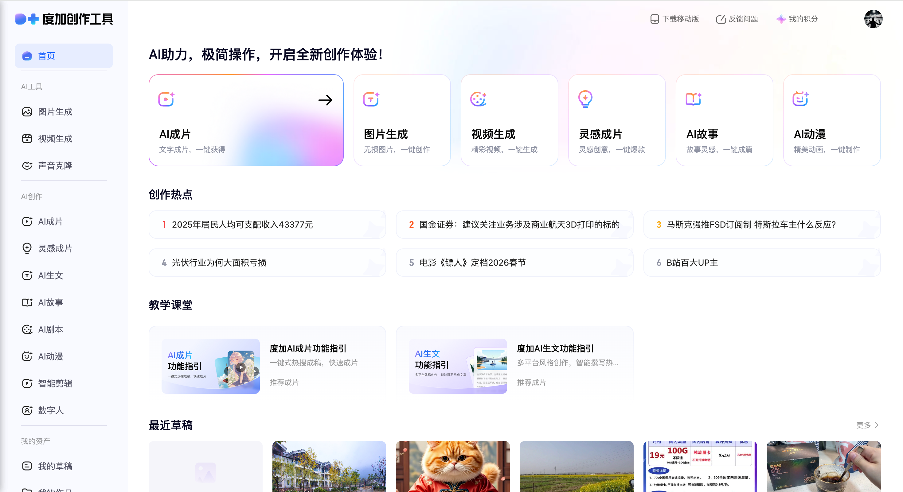

# 度加创作工具：AI视频制作全攻略

## 前言

度加创作工具（官网：[aigc.baidu.com](https://aigc.baidu.com)）是百度推出的AI视频制作平台，核心优势在于快速生成短视频内容，适配热点创作、产品宣传、知识科普等多场景，大幅提升内容生产效率。本文整理了完整使用流程、高级功能及避坑要点，适合新手快速入门。

## 一、前期准备：账号登录与功能选择

### 1.1 账号登录

1. 打开任意浏览器，访问官方地址：[https://aigc.baidu.com]

2. 使用百度账号（手机号/邮箱）登录，无需额外注册，登录后直接进入工作台界面。

### 1.2 功能选择

在工作台右侧，按需选择视频生成功能，核心选项包括：

- 「短片生成」：适合快速制作15-60秒短平快内容

- 「AI 成片」：输入文案后一键生成完整视频，无需手动剪辑

- 其他细分功能：根据场景选择对应类型，新手推荐从「AI 成片」入手。

## 二、核心视频制作流程

### 2.1 文案生成与润色（视频灵魂第一步）

支持两种文案模式，可根据自身需求选择：

#### 热点文案（快速追更首选）

1. 右侧面板查看「新闻热点推荐」，点击心仪标题；

2. 左侧自动生成对应文案，点击「AI 润色」优化语句流畅度、适配短视频节奏；

3. 文案满意后，直接点击「一键成片」进入下一步。

#### 自定义文案（个性化内容创作）

1. 在文案输入框中填写视频主题、情节、核心观点，支持最大1200字；

2. 设置基础参数：
        

    - 时长：10秒 - 2分钟（推荐15-60秒，适配主流平台传播）

    - 比例：9:16（竖版，适配抖音/小红书）、16:9（横版，适配B站/视频号）

3. 参数设置完成后，点击生成进入编辑环节。

### 2.2 视频编辑（精细化优化画面与声音）

生成初始视频后，进入剪辑页面，可通过左侧工具栏完成以下操作：

- **字幕修改**：点击「字幕」栏，编辑字幕内容、调整字体样式、大小、颜色，确保字幕与语音同步。

- **素材添加/替换**：通过「素材库」选择免费素材（图片、视频片段），预览无误后点击「+」添加至时间轴；也可替换现有素材，优化画面表现力。

- **模板更换**：在「模板」栏切换横版/竖版模板，模板自带排版与转场，快速适配不同发布场景。

- **配音调整**：进入「朗读音」栏选择配音音色（男声/女声/童声），试听后调节语速、音量，让配音与视频风格匹配（如温情内容选柔和音色，科普内容选清晰干练音色）。

- **画面增强**：添加贴纸、音效、动画特效，同时可设置包装力度（不包装/少量/中度/丰富），新手建议「少量包装」，避免画面杂乱。

### 2.3 视频生成与导出（完成制作落地）

1. 编辑完成后，点击右上角「发布视频」→ 选择「生成视频」，等待系统合成（合成速度取决于视频时长，一般1-3分钟）。

2. 预览与下载：生成成功后，在首页找到对应视频预览，确认无误后点击下载键保存至本地；支持批量导出多个视频，适合批量创作场景。

## 三、高级功能：解锁更多创作可能性

除基础功能外，工具还提供三大高级功能，满足专业创作需求：

### 3.1 分镜编辑

选择「金条模式」，可对脚本、角色形象、分镜细节逐帧优化，确保整体视频风格统一，适合制作剧情类、叙事类视频。

### 3.2 商品视频

专为产品宣传设计：上传产品图片，输入产品核心亮点（卖点、参数、使用场景），设置比例与生成模式，系统自动生成专业级商品宣传短片，适配电商平台推广。

### 3.3 创意特效

上传单张图片（手办、证件照、漫画分镜等），选择预设的30+种特效，生成5-10秒创意视频片段，适合打造个性内容、吸引流量。

## 四、注意事项：避坑指南与合规提醒

- **素材合规**：严格使用平台素材库资源，禁止使用侵权素材（图片、音乐、视频片段），避免账号受限或法律纠纷。

- **文案优化**：描述主题、情节时需清晰具体，提升AI生成画面的准确性；复杂内容建议分段生成，再拼接编辑，避免整体生成效果不佳。

- **参数适配**：根据发布平台选择比例（抖音/小红书优先9:16，B站/西瓜视频优先16:9），时长控制在1-3分钟内，符合平台传播规律。

- **积分管理**：基础功能免费使用，部分高级功能（如专属特效、高清导出）消耗积分；每日登录可领取积分，也可通过完成平台任务获取额外积分，合理规划积分使用。

## 五、常见问题：故障排查与解决方案

- **生成失败**：检查文案长度（不超过1200字）、格式是否规范，确保网络稳定，关闭浏览器重试；若多次失败，可分段生成文案。

- **画质不佳**：优先选择素材库高清素材，调整模板与包装力度，同时优化配音与画面的匹配度，避免画面与声音脱节。

- **字幕错误**：手动修改字幕内容，或重新使用「AI 润色」功能优化文案，减少字幕识别误差。

## 六、总结

度加创作工具的核心价值的是「低门槛、高效率」，无需专业剪辑技能，即可快速生成高质量短视频。新手建议从热点文案+AI成片入手，熟悉基础操作后，再尝试分镜编辑、创意特效等高级功能，逐步提升内容创作质量。无论是自媒体人、电商运营还是职场人士，都能通过该工具快速产出适配不同场景的视频内容。